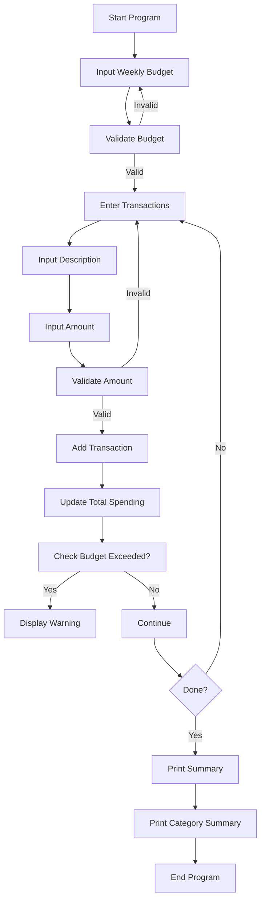

## Flowchart

```mermaid
flowchart TD
    A[Start Program] --> B[Input Weekly Budget]
    B --> C[Validate Budget]
    C -->|Valid| D[Enter Transactions]
    C -->|Invalid| B

    D --> E[Input Description]
    E --> F[Input Amount]
    F --> G[Validate Amount]

    G -->|Valid| H[Add Transaction]
    G -->|Invalid| D

    H --> I[Update Total Spending]
    I --> J[Check Budget Exceeded?]

    J -->|Yes| K[Display Warning]
    J -->|No| L[Continue]

    L --> M{Done?}
    M -->|No| D
    M -->|Yes| N[Print Summary]
    N --> O[Print Category Summary]
    O --> P[End Program]
```
